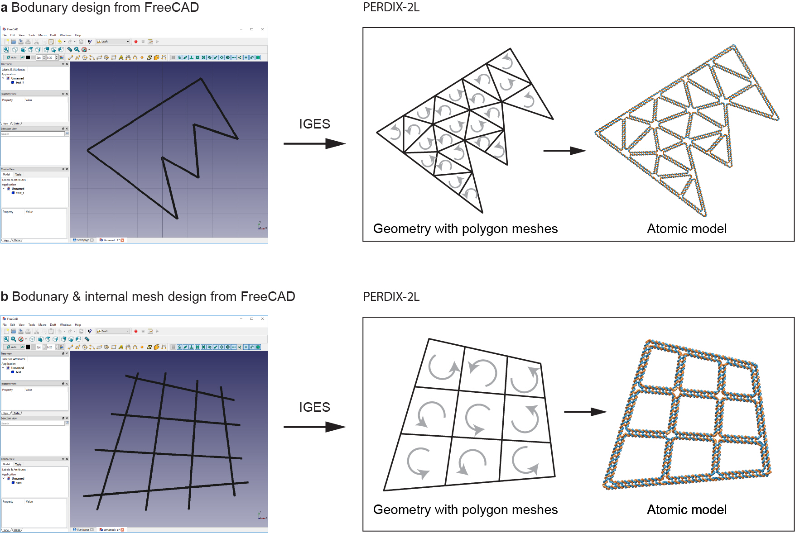

## PERDIX-2L</br>

> Welcome to the PERDIX project! PERDIX is an open-source software written by FORTRAN 90/95, which allows scientists to build and solve the sequence design of complex DNA DX-based wireframe lattices.</br>

<center></center>

**PERDIX:**</br>
**P**urine / Pyrimidine **E**ngineered **R**ecombinant **D**esign **I**nverse **X** (= as the universal unknown variable for which the software will find the 'solution' as staple sequences)</br>

**Software Variants:**</br>
* **[PERDIX-6P](https://github.com/hmjeon/PERDIX-6P)**: Designer scaffolded DNA 6HB-based wireframe nanoparticles</br>
* **[PERDIX-2L](https://github.com/hmjeon/PERDIX-2L)**: Designer scaffolded DNA DX-based wireframe lattices</br>

## Features</br>
* Fully automatic procedure for the scaffold routing and sequence design</br>
* Importing GEO, [IGES/IGS](https://en.wikipedia.org/wiki/IGES), or [PLY](https://en.wikipedia.org/wiki/PLY_(file_format)) file formats</br>
* Exact edge-lengths to design highly asymmetric and irregular shapes</br>
* JSON output for editing staples from [caDNAno](https://cadnano.org/)</br>
* 3D visualization powered by [UCSF Chimera](https://www.cgl.ucsf.edu/chimera/)</br>
* Pre-defined 24 target geometries</br>
* User-friendly TUI (Text-based User Interface)</br>
* [Executable files](./release) for Windows and Mac OS X systems</br>
* Free and open source ([GNU General Public License, version 3.0](https://www.gnu.org/licenses/gpl-3.0.en.html/))</br>

## Setup</br>
```git clone https://github.com/hmjeon/PERDIX-2L.git```

**Requirements:**</br>
1. [Intel Fortran compiler](https://software.intel.com/en-us/fortran-compilers) (tested version - Interl Parallel Studio XE 2016, 2017 and 2018)</br>
2. [Python 2.7](https://www.python.org/) - not compatible with Python 3</br>
3. [MATLAB](https://www.mathworks.com) (tested version - MATLAB 2015, 2016, 2017 and 2018)

- Compiling the PERDIX sources require [Intel Fortran](https://software.intel.com/en-us/fortran-compilers). Intel Fortran is available under a free, non-commercial license for qualified students on Linux, OS X and WIndows, see the [details](https://software.intel.com/en-us/qualify-for-free-software/).</br>
- [Shapely](https://pypi.org/project/Shapely/) and [DistMesh](http://persson.berkeley.edu/distmesh/) are used to convert a set of lines to polygon meshes.
- The software document can be downloaded [here](./release/Software%20Document.pdf).</br>
- The atomic model ([PDB](https://en.wikipedia.org/wiki/Protein_Data_Bank_(file_format))) can be generated by cndo file using [MATLAB scripts](https://cando-dna-origami.org/atomic-model-generator/) written by Keyao.</br>

## Author</br>
Dr. Hyungmin Jun ([hyungminjun@outlook.com](mailto:hyungminjun@outlook.com)), [LCBB](http://lcbb.mit.edu)(Laboratory of Computational Biology and Biophysics), [MIT](http://mit.edu)</br>

## License</br>
PERDIX is an open-source software distributed under the [GPL license, version 3](https://www.gnu.org/licenses/gpl-3.0.en.html/)</br>
