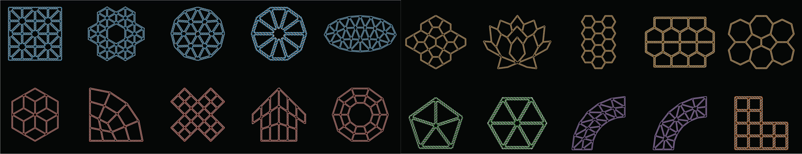

<a name="top"></a>
# PERDIX

[]()

**PERDIX** (**P**rogrammed **E**ulerian **R**outing for **D**NA Des**i**gn using **X**-overs) is a new, free and open-source software package written in FORTRAN 90/95 that enables the automated convertion of 2D computer-generated design files into DNA sequences. These DNA sequences can be subsequently synthesized and mixed to fold DNA DX-based wireframe 2D lattices with high fidelity.
PERDIX video [here](https://youtu.be/ss_5rmMNMhE).

<p align="center"></p>

+ Pure Fortran library for modern Fortran project
+ Free and open source ([GNU General Public License, version 3.0](https://www.gnu.org/licenses/gpl-3.0.en.html/))
+ Fully automatic procedure of the sequence design for scaffolded DNA DX-based wireframe lattices
+ Importing GEO, [IGS](https://en.wikipedia.org/wiki/IGES), SVG, or [PLY](https://en.wikipedia.org/wiki/PLY_(file_format)) file formats as an input
+ Exact edge-lengths to design highly asymmetric and irregular shapes
+ [JSON](https://en.wikipedia.org/wiki/JSON) output for editing staple paths and sequences from [caDNAno](https://cadnano.org/)
+ 3D visual outputs by [UCSF Chimera](https://www.cgl.ucsf.edu/chimera/)
+ 24 pre-defined target geometries
+ User-friendly TUI (Text-based User Interface)
+ Online web resources and release packages for Microsoft Windows and Mac OS

#### Compiler Support

[]()
[]()
[]()
[]()
[]()
[]()

---

[PERDIX Online](#PERDIX-Online) | [Documentation](#Documentation) | [Pre-compiled Binaries](#Pre-compiled-Binaries) | [Compiling Code](#Compiling-Code) | [Copyrights](#copyrights)

---

## PERDIX Online

[```http://perdix-dna-origami.org/```](http://perdix-dna-origami.org/)

In addition to the source code and pre-compiled binaries available here, we also offer an online web application with all the functionality found in the downloaded version. By submitting the same inputs (PLY, GEO, IGS, or SVG input CAD files), the web service will return the same file output as the downloaded version.

## Documentation

The full software documention can be downloaded [here](https://github.com/hmjeon/PERDIX/raw/master/doc/Software%20Documentation.pdf).

Please find below 3 tutorial movies on how to use PERDIX to generate computer aided design files, automate meshing, generate sequences, and review atomic models.

+ [Running PERDIX](https://youtu.be/iyrlIFPLrd8)
+ [Boundary design](https://youtu.be/o_7dMVGPxPw)
+ [Boundary & internal geometric design](https://youtu.be/Z1n2ol9OQ04)
  + The *.csv file generated by PERDIX contains final staple sequences.
  + The *.bild and *.json generated by PERDIX can be opened by [UCSF Chimera](https://www.cgl.ucsf.edu/chimera/) and [caDNAno](https://cadnano.org/).
  + The atomic model ([PDB](https://en.wikipedia.org/wiki/Protein_Data_Bank_(file_format))) can be generated by *.cndo file using the [atomic model generator](https://cando-dna-origami.org/atomic-model-generator/) written by Dr. Keyao Pan.

## Pre-compiled Binaries

+ **[PERDIX-Win-MCR](https://github.com/lcbb/PERDIX/raw/master/release/PERDIX-Win-MCR.zip)** for Microsoft Windows
  + Requirements: [MATLAB Compiler Runtime 2015](https://www.mathworks.com/products/compiler/matlab-runtime.html) and Python 2.7 and Python package, [Shapely 1.6.4](http://www.lfd.uci.edu/~gohlke/pythonlibs/#shapely)
+ **[PERDIX-Win-MATLAB](https://github.com/lcbb/PERDIX/raw/master/release/PERDIX-Win-MATLAB.zip)** for Microsoft Windows
  + Requirements: MATLAB, Python 2.7 and Python package, [Shapely 1.6.4](http://www.lfd.uci.edu/~gohlke/pythonlibs/#shapely)
+ **[PERDIX-Mac](https://github.com/lcbb/PERDIX/raw/master/release/PERDIX-Mac.zip)** for macOS/Mac OS X
  + Requirements: Python 2.7 and Python packages, [Shapely 1.6.4](https://pypi.org/project/Shapely/) and [PyDistMesh 1.2](https://pypi.org/project/PyDistMesh/)

## Compiling Code

```git clone https://github.com/hmjeon/PERDIX.git```

*Requirements to compile from source:*
+ [Intel Fortran compiler](https://software.intel.com/en-us/fortran-compilers): Intel Parallel Studio XE 2016, 2017 or 2018
+ [MATLAB](https://www.mathworks.com): MATLAB 2014, 2015, 2016, 2017 or 2018
+ [Python 2.7](https://www.python.org/): Not compatible with Python 3
+ [Shapely 1.6.4](https://pypi.org/project/Shapely/): Python package, Shapely is used to convert a set of lines to polygon meshes
+ [DistMesh](http://persson.berkeley.edu/distmesh/) or [PyDistMesh 1.2](https://pypi.org/project/PyDistMesh/): DistMesh (MATLAB version) or PyDistMesh (Python version) is used to generate internal triangular meshes
  + Compiling the PERDIX sources require [Intel Fortran](https://software.intel.com/en-us/fortran-compilers). Free Intel (R) Software Development Tools are available for qualified students, educators, academic researchers and open source contributors, see the [details](https://software.intel.com/en-us/qualify-for-free-software/).
  + The Intel Fortran compiler supports all of the features of the Fortran 90, Fortran 95, Fortran 2003 standards and most of Fortran 2008. It also supports some draft Fortran 2018 features.
  + We provide [MakeFile](./make/makefiles/Makefile) which is a simple way to organize code compilation of PERDIX.

## Copyrights

*Author*<br>
Dr. Hyungmin Jun ([hyungminjun@outlook.com](mailto:hyungminjun@outlook.com)), [LCBB](http://lcbb.mit.edu) (Laboratory for Computational Biology and Biophysics), [MIT](http://mit.edu)

*License*<br>
PERDIX is an open-source software distributed under the [GPL license, version 3](https://www.gnu.org/licenses/gpl-3.0.en.html/)

Anyone is interest to use, to develop or to contribute to PERDIX is welcome!

Go to [Top](#top)
